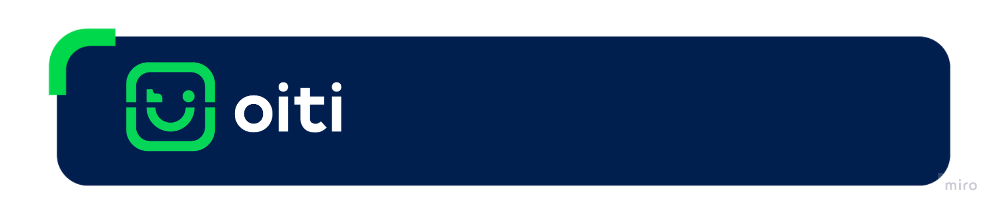

<div style="align:center;">
 
</div>

# Flutter (Bridge) para Liveness 2D e Doc Core

## Sobre este Repositório

Este repositório é responsável pela conexão do **Platform Channels do Flutter**, com ele é possível instalar e usar o SDK do Liveness 2D e Doc Core da Oiti.

### Saiba mais sobre o Liveness 2D e Doc Core

- [Descrição e Resultados - Liveness 2D](https://github.com/oititec/liveness-ios-sdk/blob/main/Documentation/Liveness2D/Liveness2D-Description.md)
- [Descrição e Resultados - Doc Core](https://github.com/oititec/liveness-ios-sdk/blob/main/Documentation/Liveness2D/Documentoscopy-Description.md)

## O que é Bridge?

A "bridge" no contexto do Flutter refere-se à infraestrutura subjacente que permite a comunicação entre o código Dart e o código nativo da plataforma, possibilitando a criação de aplicativos que podem acessar recursos e funcionalidades específicas de cada sistema operacional, além das capacidades oferecidas pelo próprio framework Flutter.

### Platform Channel:

Para realizar a comunicação entre o código Dart e o código nativo da plataforma, o Flutter usa o conceito de "platform channels" (canais de plataforma). Esses canais permitem que você envie mensagens de um lado para o outro da "ponte" entre o código Dart e o código nativo. Isso é útil quando você precisa acessar recursos ou funcionalidades específicas da plataforma que não estão diretamente disponíveis no Flutter.

### MethodChannel:

O Flutter fornece duas classes principais para facilitar a comunicação através dos canais de plataforma: MethodChannel e EventChannel. **Nesse projeto utilizamos apenas do MethodChannel que permite que você invoque métodos do código nativo a partir do Dart e obtenha callback`s**.

<div style="align:center;">
 
</div>

## Sumário

As instruções de uso, integração, implementação e customização do **Liveness 2D** e **Doc Core** podem ser acessados através do sumário abaixo:

### Flutter

- [Configuração do Platform Channel](documentation/flutter/platform_channel_config.md).
- [Tratamento de Responses/Callback](documentation/flutter/callback.md).

### Android

- [Configuração Inicial](documentation/android/initial_config.md)
- [Configuração do FlutterEngine e MethodChannel](documentation/android/flutter_engine_config.md)
- [Configuração dos Responses/Callback](documentation/android/callback.md)

Acesse o nosso DevCenter para consultar os guias para Liveness 2D ([Integração](https://devcenter.certiface.io/docs/guia-de-uso-e-integracao-android) e [Customização](https://devcenter.certiface.io/docs/customizacao-telas-de-inicializacao-liveness2d-android)) e Doc Core ([Integração](https://devcenter.certiface.io/docs/guia-de-uso-e-integracao-android) e [Customização](https://devcenter.certiface.io/docs/doc-core-android)). 

### iOS

- [Configuração Inicial](documentation/ios/initial_config.md)
- [Configuração do FlutterEngine e MethodChannel](documentation/ios/flutter_engine_config.md)
- [Configuração dos Responses/Callback](documentation/ios/callback.md)

Acesse o nosso DevCenter para consultar os guias de Integração e Customização para o [Liveness 2D](https://devcenter.certiface.io/docs/liveness2d-monolito-ios) e [Doc Core](https://devcenter.certiface.io/docs/doc-core-monolito-ios) iOS. 

### Como executar o clone do Repositório?

Execute o clone do repositório abaixo para baixar o código:

```sh
git clone https://github.com/oititec/flutter-liveness2d-bridge
```

### Como rodar o Script?

Para rodar o script desse repositório você deve instalar as dependências do projeto executando o seguinte comando no terminal;

#### Dependências

```sh
flutter pub get
```

### Como executar o projeto?

> Executar sempre em dispositivos físicos e não no simulador do iOS e Android pois nossa SDK tem emulator detection.

```sh
flutter run
```

Em seguida deve seguir escolher o dispositivo android ou iOS de debug listado no terminal.

